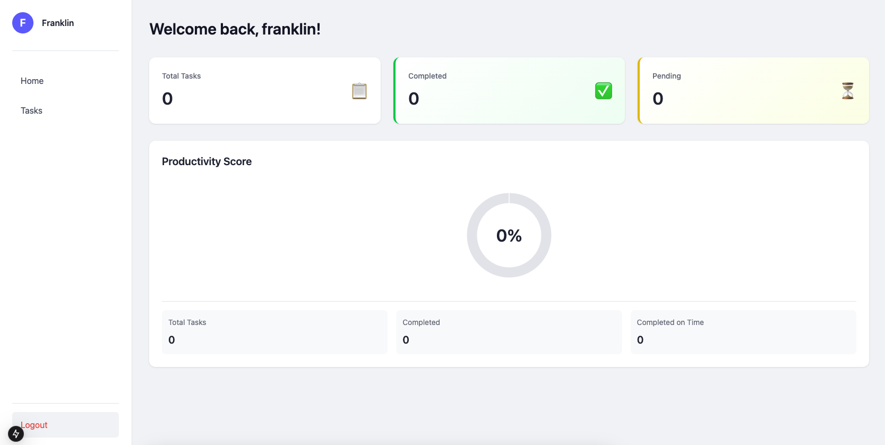
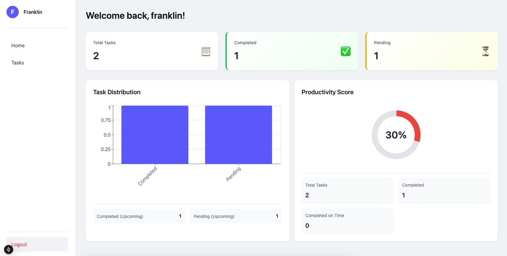
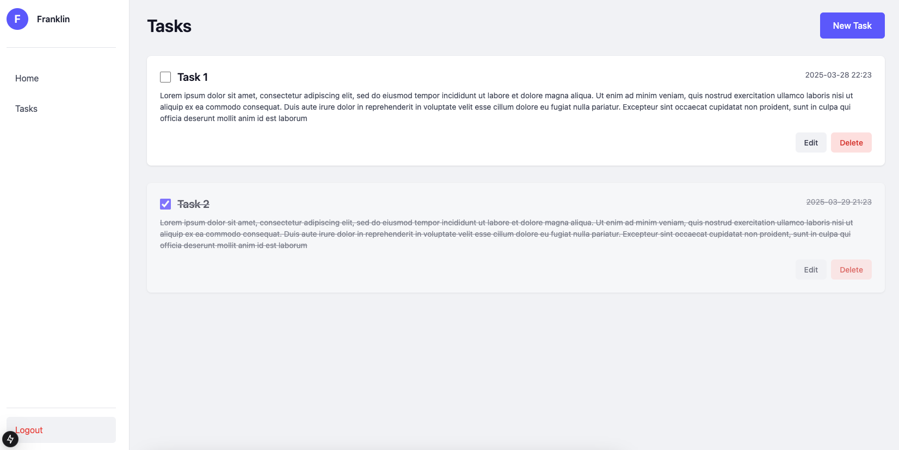

# Challenge Logixs

## Screenshot de la App.

- Dashboard sin tareas:



- Dashboard con más de una tarea:



- Lista de tareas:



## Descripción

Este proyecto es una aplicación de gestión de tareas desarrollada como un monorepo utilizando Nx. El sistema está compuesto por una API backend y un dashboard frontend.

## Tecnologías Principales

- **Nx**: Gestión del monorepo
- **Backend**: Node.js con AWS Serverless Framework
- **Frontend**: Next.js
- **Base de datos**: PostgreSQL
- **Docker**: Containerización y despliegue

## Requisitos Previos

- Node.js
- Docker y Docker Compose
- Nx CLI (`npm i -g nx`)

## Configuración del Entorno

### 1. Instalación de Dependencias

```bash
npm install
```

### 2. Variables de Entorno

El proyecto incluye archivos `.env` preconfigurados en las siguientes ubicaciones:

- `/apps/api/.env` - Configuración del backend
- `/apps/dashboard/.env` - Configuración del frontend
- `/.env` - Configuración global

## Iniciar el Proyecto

### 1. Iniciar Servicios con Docker

```bash
docker-compose up -d
```

Esto iniciará:

- API en `http://localhost:4242`
- PostgreSQL en `localhost:5432`

### 2. Iniciar el Dashboard

```bash
npx nx dev dashboard
```

## API Endpoints

### Autenticación

| Método | Endpoint       | Descripción                    |
| ------ | -------------- | ------------------------------ |
| POST   | `/auth/signup` | Registro de nuevo usuario      |
| POST   | `/auth/signin` | Inicio de sesión (retorna JWT) |

### Gestión de Tareas

| Método | Endpoint     | Descripción                         |
| ------ | ------------ | ----------------------------------- |
| GET    | `/tasks`     | Listar todas las tareas del usuario |
| GET    | `/tasks/:id` | Obtener tarea específica            |
| POST   | `/tasks`     | Crear nueva tarea                   |
| PUT    | `/tasks/:id` | Actualizar tarea existente          |
| DELETE | `/tasks/:id` | Eliminar tarea                      |

### Estadísticas

| Método | Endpoint                 | Descripción                      |
| ------ | ------------------------ | -------------------------------- |
| GET    | `/stats/overview`        | Estadísticas generales de tareas |
| GET    | `/stats/completion-rate` | Tasa de finalización mensual     |
| GET    | `/stats/distribution`    | Distribución por estado y fecha  |
| GET    | `/stats/productivity`    | Métricas de productividad        |

### Detalles de Estadísticas

El endpoint `/stats/overview` proporciona:

- Total de tareas
- Tareas completadas
- Tareas pendientes
- Tareas vencidas
- Tareas próximas
- Tareas sin fecha de vencimiento

### Áreas de Mejora

- Documentación de API más detallada
- Tests unitarios
- CI/CD pipeline
- Monitoreo y logging
